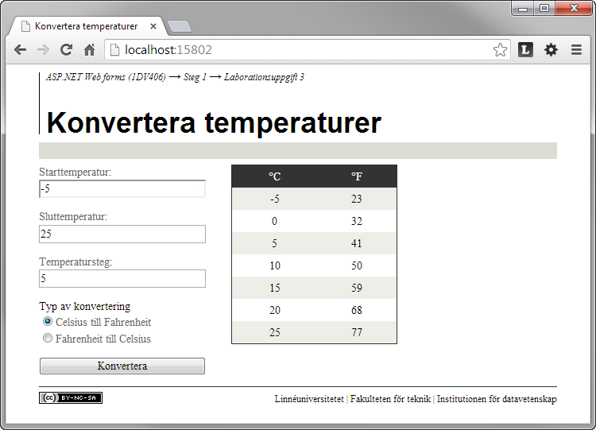

1.3 Konvertera temperaturer
===========================
[1-3-konvertera-temperaturer.pdf](https://github.com/1dv406/kursmaterial/raw/master/Laborationsuppgifter/1-3-konvertera-temperaturer.pdf)

"Du ska skriva en webbapplikation där användaren ska kunna skapa en tabell med temperaturer konverterade mellan grader Celsius och grader Fahrenheit eller mellan grader Fahrenheit och grader Celsius.

För att skapa en tabell med konverterade temperaturer matar användaren in i ett formulär vilken temperatur tabellen ska börja från och temperaturen tabellen ska sluta med. Användaren måste även ange i formuläret hur stor temperaturökningen ska vara mellan varje temperatur fram till och med sluttemperaturen samt om konverteringen ska ske från grader Celsius till grader Fahrenheit eller från grader Fahrenheit till grader Celsius."
